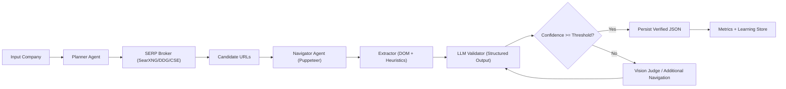

# ANTIGRAVITY "ZERO-COST" AI UPGRADE
## State-of-the-Art Report for PG-Scraper (Italian SMB Data Verification)

Date: February 12, 2026  
Authoring Mode: Deep research + codebase-specific architecture design  
Scope: Maximize verified Websites/VAT/Emails/Phones with minimum recurring spend

---

## Executive Summary

PG-Scraper is already beyond a basic "Puppeteer + regex" stack. Your current PG3 codebase includes wave-based discovery, anti-bot heuristics, LLM validation hooks, and multi-provider fetch logic (`Scrape.do`, Jina, direct browser). However, the stack is still partially dependent on paid bypass channels and has several architecture bottlenecks that keep quality below true enterprise-grade consistency.

The core strategic shift is:

**From brute-force scraping to AI-orchestrated evidence collection.**

That means:

1. Keep deterministic code for low-cost, high-volume operations.
2. Use AI only when uncertainty is high (navigation ambiguity, entity disambiguation, weak evidence).
3. Replace paid data vendor/API dependence with:
   - self-hosted metasearch,
   - targeted dorks,
   - agentic in-site navigation,
   - structured LLM verification,
   - selective vision checks.

Key conclusion:

- You can remove most recurring spend on SERP APIs and data vendors.
- You cannot reliably remove all network-evasion cost at scale using only free infra.
- The practical target is a **hybrid cost floor**: mostly free/open-source with minimal paid failover reserved for hard targets.

---

## Methodology

This report combines:

1. **Internal architecture audit** of your repository.
2. **Primary-source research** (official docs/repos/spec pages) on anti-detection, search alternatives, agents, and model economics.
3. **Production design recommendations** optimized for Node.js + PG3 constraints.

### Internal Audit Snapshot (PG3)

Strong existing components:

- Multi-wave discovery and confidence scoring in `UnifiedDiscoveryService`.
- Deterministic entity matching with VAT/phone/name/domain signals.
- LLM fallback validator already integrated.
- Contact-page supplemental crawl support.
- Existing anti-bot primitives: evasion hooks, stealth plugin usage (partially disabled), Tor path, proxy tiering.

Relevant files:

- `/Users/marcomilanello/Documents/PG scraper ecc/PG/pg3/src/enricher/core/discovery/unified_discovery_service.ts`
- `/Users/marcomilanello/Documents/PG scraper ecc/PG/pg3/src/enricher/core/discovery/company_matcher.ts`
- `/Users/marcomilanello/Documents/PG scraper ecc/PG/pg3/src/enricher/core/discovery/search_provider.ts`
- `/Users/marcomilanello/Documents/PG scraper ecc/PG/pg3/src/enricher/core/browser/factory_v2.ts`
- `/Users/marcomilanello/Documents/PG scraper ecc/PG/pg3/src/enricher/core/security/captcha_solver.ts`
- `/Users/marcomilanello/Documents/PG scraper ecc/PG/pg3/src/enricher/core/ai/llm_validator.ts`
- `/Users/marcomilanello/Documents/PG scraper ecc/PG/pg3/src/enricher/core/ai/llm_service.ts`

Critical gaps:

1. Stealth setup is inconsistent (enabled in some paths, disabled in others).
2. Search dependence still leans on paid-style gateways (`scrape_do`) for Google reliability.
3. LLM validation uses free-form JSON parsing instead of schema-constrained outputs.
4. Cost tracker uses outdated token economics assumptions.
5. Agentic navigation exists only as light heuristic link-following, not true decision-driven browsing.

---

## Chapter 1: The Self-Healing Scraper (Replacing Paid Proxy Dependence)

## 1.1 Threat Model Reality

Modern anti-bot systems evaluate multiple dimensions:

- Browser fingerprint consistency.
- Interaction patterns.
- Network reputation/IP history.
- Session continuity.
- Challenge response behavior.

Cloudflare’s official product documentation confirms broad bot-management and challenge mechanisms, not just simple `navigator.webdriver` checks. Inference: "stealth plugin only" will never be enough for sustained high-volume extraction.

## 1.2 Tool Landscape (What Actually Works in 2026)

### A) `puppeteer-extra-plugin-stealth`

- Still widely used in Node automation stacks.
- Good baseline evasions for common browser-surface checks.
- Limitation: no network reputation fix, and evasion freshness depends on community maintenance.

### B) `playwright-stealth` ecosystem

- Available but appears stale (NPM publication age indicates long update gaps).
- Inference: unsafe as primary foundation for long-term enterprise operation.

### C) `undetected-chromedriver` / `nodriver`

- `undetected-chromedriver` explicitly states it does **not** hide IP reputation.
- Strong for Selenium-based Python workflows; not native fit for your Node-first architecture.
- `nodriver` indicates a newer direction in the same ecosystem.

### D) Agent browsing frameworks (`browser-use`, `Agent-S`)

- `browser-use` provides high-level browser control via LLM planning.
- Its own docs emphasize cloud mode for production-grade CAPTCHA/high-scale reliability.
- Agent-S research and repo show strong benchmark orientation for computer-use automation.

Inference: these frameworks are useful for reasoning/navigation layers, but not a full substitute for hardened browser/network primitives.

## 1.3 Recommended Self-Healing Architecture

### Principle: Separate "behavior intelligence" from "transport reliability"

- **Behavior intelligence (AI):** decide what to click, where to navigate, when evidence is sufficient.
- **Transport reliability (systems):** session reuse, retries, cooldowns, adaptive pacing, and selective IP diversity.

### Proposed 4-layer anti-block loop

1. **Session Persona Layer**
- Persistent per-domain profiles (cookies, timezone, locale, viewport family).
- Stable user-agent cohorts instead of per-request randomization.

2. **Humanized Action Layer**
- Keep deterministic movement generator for speed.
- Use LLM only for semantic action selection (example: identify Italian cookie banner reject button).
- Avoid "LLM controls every mouse pixel" because token cost + latency + fragility.

3. **Adaptive Traffic Layer**
- Domain-specific cadence (cooldown windows per target class).
- Concurrency budgets per domain risk score.
- Dynamic downgrade from heavy browser to cheap HTTP/Jina when page type allows.

4. **Recovery Layer**
- If blocked: rotate strategy (not only proxy).
- Alternate order: `Direct -> Tor -> Free validated proxy -> Paid emergency route`.
- Preserve forensic reason codes for model tuning.

## 1.4 PG3-specific Refactor Targets

1. Consolidate browser launch/evasion logic between scraper/enricher factories into one hardened module.
2. Re-enable stealth carefully with automated smoke checks (the plugin is currently commented in key files).
3. Promote `HumanBehavior` into policy-driven engine with per-domain scripts.
4. Add explicit "block signature classifier" (captcha/403/challenge/waf timeout) to drive next-step policy.

---

## Chapter 2: The Free SERP API (Without the Monthly Bill)

## 2.1 What Changed Externally

- Microsoft officially retired Bing Search APIs on **August 11, 2025**.
- Google Programmable Search remains available with a **100 free queries/day** tier.
- Whoogle is still usable as OSS but maintainers documented severe abuse traffic events (January 16, 2025), signaling operational fragility if self-hosted without strong rate protection.

## 2.2 Free/Open Search Stack Blueprint

### Primary: Self-hosted SearXNG

Why:

- Open metasearch engine.
- Privacy-preserving architecture.
- Engine-level configuration and limiter support in official docs.

How to use in PG-Scraper:

1. Self-host 2+ SearXNG nodes (different VPS/ASNs if possible).
2. Restrict engines to those with best IT SMB coverage and acceptable block profile.
3. Enable limiter and per-client throttling.
4. Build a `SerpBroker` module that queries SearXNG first.

### Secondary: Whoogle (niche fallback)

- Keep as optional plugin, not primary.
- Harden with strict rate limiting and circuit breaker.
- Treat as brittle due ongoing anti-bot pressure on Google scraping frontends.

### Tertiary: Direct DDG/Bing HTML scraping

- Use only as bounded backup flows.
- Always cache query results aggressively.
- Build per-engine error signatures to avoid hammering when blocked.

### Strategic legal route: Google Programmable Search API

- Use free 100/day quota only for highest-value unresolved records.
- This is your cleanest low-volume legal fallback.

## 2.3 The "Dork Intelligence" Layer

Your existing `google_dorker.ts` is a strong starting point. Expand it into retrieval policy:

1. Generate query families by objective:
- website discovery
- VAT confirmation
- email/contact page discovery
- decision-maker hints

2. Prioritize high-specificity dorks to reduce CAPTCHA triggers:
- `"company" "city" site:.it`
- `"company" "Partita IVA"`
- `site:facebook.com "company" "city"`
- `site:linkedin.com/company "company"`

3. Use LLM query critic:
- score dork uniqueness,
- avoid broad terms,
- detect overfitting.

## 2.4 Free Proxy Rotation (Realistic Design)

Public proxies are noisy and often malicious/unreliable.

Design instead:

1. Ingest free proxy feeds.
2. Validate in sandbox:
- TLS handshake,
- response latency,
- anonymity test,
- blocklist score,
- success on known benign probe pages.
3. Assign quality score and short TTL.
4. Use only for low-value discovery, never for sensitive post-processing.

Inference: this reduces paid proxy dependence but cannot fully replace high-reputation residential routes for hardest targets.

---

## Chapter 3: AI Validation (Replacing the "Human Eye")

## 3.1 Current State

You already run AI validation fallback via `LLMValidator`. This is strong, but implementation can be made much more reliable.

Current issues:

1. Free-form JSON parsing is brittle.
2. Prompt truncation may cut decisive evidence.
3. Cost accounting is stale versus current model pricing.

## 3.2 Target Validation Stack

### Stage A: Deterministic pre-extraction (cheap)

- Regex/heuristics for obvious VAT/phone/email candidates.
- DOM section segmentation (footer/contact/legal pages).
- Language and directory filters.

### Stage B: Structured LLM judgment

Use schema-constrained output (Structured Outputs / JSON schema) to enforce:

```json
{
  "is_match": true,
  "confidence": 0.0,
  "entity_type": "official_site|directory|social|uncertain",
  "matched_signals": {
    "vat": "",
    "phone": "",
    "email": "",
    "name_tokens": []
  },
  "reasoning_short": "",
  "next_action": "accept|crawl_contact|reject"
}
```

### Stage C: Vision Judge (selective)

Use screenshot-based verification only when textual evidence is ambiguous.

Examples:

- "Does this page visually represent an Italian mechanic workshop?"
- "Is this an official company site vs listing portal?"

Run this only for borderline confidence band (for example 0.45-0.75) to control spend.

## 3.3 2026 Cost Model

OpenAI pricing page indicates:

- `gpt-4o-mini`: very low per-million-token cost.
- Batch API: 50% savings for async workloads.
- Prompt caching discounts cached input tokens.

Inference for PG-Scraper:

- Most validation workloads can run on `gpt-4o-mini` + structured outputs.
- Use batch mode for nightly re-validation queues.
- Reserve larger models for adjudication only.

## 3.4 Local Model Strategy (Ollama)

Use Ollama as on-prem fallback for:

- PII-sensitive enrichment tasks.
- offline reranking/classification.

Recommended split:

1. Local model (Ollama + Llama/Qwen family): cheap bulk classification.
2. API model (`gpt-4o-mini`): high-precision extraction and tie-breaks.

This gives cost control while preserving quality where it matters.

## 3.5 Mandatory Fix in Your Codebase

`LLMService.trackCost` currently uses legacy price constants that overestimate/incorrectly model modern pricing. Update this immediately and pull prices from centralized config.

File:

- `/Users/marcomilanello/Documents/PG scraper ecc/PG/pg3/src/enricher/core/ai/llm_service.ts`

---

## Chapter 4: Intelligent Enrichment (Navigation Agents)

## 4.1 Current State in PG3

You already implemented a lightweight enrichment pattern:

- collect likely contact links,
- fetch supplemental pages,
- re-evaluate confidence.

This is good, but still rule-based.

## 4.2 Upgrade to Agentic Navigation

### Agent policy loop

1. Load homepage.
2. Extract candidate actions (links/buttons/forms).
3. Ask planner model: "which action increases probability of finding official contact data?"
4. Execute chosen action.
5. Re-score evidence.
6. Stop when confidence target or budget exhausted.

### Action budget controls

- Max steps per domain: 4-6.
- Max new tabs: 2.
- Hard timeout per company.
- Token budget per company.

### Tooling options

- Keep native Puppeteer core.
- Use LangGraph/LangChain for durable state machine and retries.
- CrewAI can orchestrate multi-agent roles, but LangGraph-style state control is usually easier for deterministic production tracing.

## 4.3 Agent roles for this chapter

- **Navigator:** executes click/open/back actions.
- **Semantic Link Judge:** ranks links by expected contact yield.
- **Extractor:** transforms current page into normalized evidence JSON.
- **Stop Controller:** terminates when confidence > threshold or budget consumed.

## 4.4 Why this beats homepage-only scraping

- Captures hidden contact pages (`/contatti`, `/chi-siamo`, legal footer pages).
- Handles JS-heavy layouts where static HTML misses data.
- Mimics human research path without requiring expensive third-party datasets.

---

## Chapter 5: The Mini-AGI Architecture for PG-Scraper

## 5.1 High-Level Workflow



## 5.2 Agent Definitions

### Planner

Input: company profile + prior failures + cost budget.  
Output: ranked search/navigation plan.

### Navigator

Input: plan step + current browser state.  
Output: page snapshot bundle (`url`, `title`, `text`, `links`, `screenshot`, `events`).

### Vision Judge

Input: screenshot + short context.  
Output: visual confidence on business identity/page type.

### Extractor

Input: text/DOM + linked-page evidence.  
Output: canonical contact fields + provenance.

### Decision Engine

Input: all evidence objects.  
Output: accept/retry/reject + reason code.

## 5.3 Data Contracts (Non-negotiable)

Every stage must return strict JSON with:

- `company_id`
- `source_url`
- `field`
- `value`
- `confidence`
- `evidence_span`
- `timestamp`
- `method` (`rule|llm|vision|hybrid`)

This enables auditability and enterprise trust.

## 5.4 Reliability Patterns

1. Circuit breakers per domain.
2. Retry policies by failure class (timeout/challenge/parse/no-evidence).
3. Idempotent job keys.
4. Evidence caching by normalized URL hash.
5. Model fallback ladder (`local -> 4o-mini -> stronger model if needed`).

---

## Implementation Blueprint for PG3 (90-Day)

## Phase 1 (Weeks 1-3): Stabilize Core

1. Unify browser/evasion/fingerprint modules into one runtime package.
2. Add structured-output validation endpoint and replace permissive JSON parsing.
3. Fix LLM cost accounting and wire model pricing via config.
4. Add domain-specific block reason telemetry.

## Phase 2 (Weeks 4-7): Free Search Backbone

1. Deploy SearXNG cluster and `SerpBroker` abstraction.
2. Move Google scraping to fallback-only route.
3. Integrate dork generation critic and query cache.
4. Add low-volume Google CSE fallback lane.

## Phase 3 (Weeks 8-10): Agentic Navigation

1. Implement action planner over current `collectEvidenceLinks` flow.
2. Add step budgets and termination policy.
3. Add screenshot capture for ambiguity band only.

## Phase 4 (Weeks 11-13): Optimization and Learning

1. Build evidence-level QA dataset from real runs.
2. Tune thresholds by vertical (autofficine, studi, retail, etc.).
3. Add continuous benchmark suite (precision/recall/cost/latency).

---

## KPI Framework (Enterprise Data Quality)

Track weekly and per-source:

1. Website verification precision.
2. VAT exact-match precision and recall.
3. Email deliverability proxy score.
4. Phone validity score (E.164 + reachability heuristics).
5. Cost per verified company.
6. Block rate by source/domain.
7. Agent steps per successful verification.

Target profile after migration:

- Higher precision via structured AI adjudication.
- Similar or improved recall via contact-page navigation.
- Lower recurring cost via self-hosted search + batch inference.

---

## Risk Register

1. **ToS/compliance risk:** search engines and target sites may restrict automated access.
2. **Model hallucination risk:** requires schema + evidence-span enforcement.
3. **Free proxy abuse risk:** isolate and never trust blindly.
4. **Stale stealth tooling risk:** must maintain regression harness for bot-detection checks.
5. **Operational complexity risk:** agent systems need strict budgets and observability to avoid runaway cost.

---

## Final Recommendation Set (Direct)

1. Keep your current PG3 architecture as base; do not rewrite from zero.
2. Build a `SerpBroker` with SearXNG-first strategy and CSE emergency lane.
3. Replace weak JSON parsing with structured outputs immediately.
4. Evolve from heuristic link-following to budgeted navigation agent.
5. Use vision selectively, not universally.
6. Keep minimal paid failover for hardest anti-bot cases; optimize for near-zero, not absolute zero.

This is the practical path to **enterprise-grade quality with AI-heavy, subscription-light operations**.

---

## Source Links (Primary)

1. Puppeteer Extra / Stealth plugin repo: [https://github.com/berstend/puppeteer-extra](https://github.com/berstend/puppeteer-extra)
2. Playwright mouse/input docs: [https://playwright.dev/docs/input](https://playwright.dev/docs/input)
3. `playwright-stealth` package metadata (publication recency): [https://www.npmjs.com/package/playwright-stealth](https://www.npmjs.com/package/playwright-stealth)
4. `undetected-chromedriver` repo and notes: [https://github.com/ultrafunkamsterdam/undetected-chromedriver](https://github.com/ultrafunkamsterdam/undetected-chromedriver)
5. `nodriver` repo: [https://github.com/ultrafunkamsterdam/nodriver](https://github.com/ultrafunkamsterdam/nodriver)
6. Browser Use repo/docs: [https://github.com/browser-use/browser-use](https://github.com/browser-use/browser-use)
7. Agent-S repo: [https://github.com/simular-ai/Agent-S](https://github.com/simular-ai/Agent-S)
8. Agent-S paper entry: [https://arxiv.org/abs/2410.08164](https://arxiv.org/abs/2410.08164)
9. SearXNG documentation (about/config/plugins/limiter): [https://docs.searxng.org/](https://docs.searxng.org/)
10. Whoogle Search repo: [https://github.com/benbusby/whoogle-search](https://github.com/benbusby/whoogle-search)
11. Bing Search API retirement notice (Aug 11, 2025): [https://learn.microsoft.com/en-us/bing/search-apis](https://learn.microsoft.com/en-us/bing/search-apis)
12. Google Programmable Search overview/pricing: [https://developers.google.com/custom-search](https://developers.google.com/custom-search)
13. OpenAI API pricing (includes GPT-4o-mini, Batch, cached input): [https://openai.com/api/pricing/](https://openai.com/api/pricing/)
14. OpenAI Structured Outputs guide: [https://platform.openai.com/docs/guides/structured-outputs](https://platform.openai.com/docs/guides/structured-outputs)
15. OpenAI Images and Vision guide: [https://platform.openai.com/docs/guides/images-vision](https://platform.openai.com/docs/guides/images-vision)
16. OpenAI Prompt Caching guide: [https://platform.openai.com/docs/guides/prompt-caching](https://platform.openai.com/docs/guides/prompt-caching)
17. Ollama docs and model catalog: [https://ollama.com/](https://ollama.com/)
18. Llama 3.3 model card (HF): [https://huggingface.co/meta-llama/Llama-3.3-70B-Instruct](https://huggingface.co/meta-llama/Llama-3.3-70B-Instruct)
19. CrewAI docs: [https://docs.crewai.com/](https://docs.crewai.com/)
20. LangChain docs (overview): [https://docs.langchain.com/oss/](https://docs.langchain.com/oss/)
21. LangChain web research retriever API reference: [https://python.langchain.com/api_reference/community/retrievers/langchain_community.retrievers.web_research.WebResearchRetriever.html](https://python.langchain.com/api_reference/community/retrievers/langchain_community.retrievers.web_research.WebResearchRetriever.html)
22. Cloudflare bot management docs: [https://developers.cloudflare.com/bots/](https://developers.cloudflare.com/bots/)
23. Tor control/rotation behavior (Stem FAQ/docs): [https://stem.torproject.org/faq.html](https://stem.torproject.org/faq.html)

